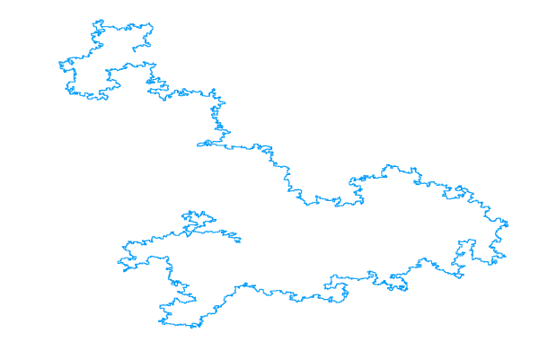

# Polymer

A Julia implementation of the pivot algorithm: a Markov chain Monte carlo (MCMC) sampler for the self-avoiding walk (SAW) model of a linear polymer chain.

<table style="width:100%">
	<!-- 2D -->
	<!-- Images -->
	<tr>
		<td><a href="https://plot.ly/~bencwallace/4/" target="_blank"></a></td>
		<td></td>
	</tr>
	<!-- Captions -->
	<tr>
		<td><font size="1">2D SAW with 10000 steps</font></td>
		<td><font size="1">Pivot algorithm in 2D</font></td>
	</tr>
	<!-- 3D -->
	<!-- Images -->
	<tr>
		<td><a href="https://plot.ly/~bencwallace/8/" target="_blank"></a></td>
		<td></td>
	</tr>
	<!-- Captions -->
	<tr>
		<td><font size="1">3D SAW with 10000 steps</font></td>
		<td><font size="1">Pivot algorithm in 3D</font></td>
	</tr>
</table>

### Interactive examples

Click on any of the (static) images above to view interactive examples (generated with [Plotly](https://plot.ly/)).

### Related

My other repository, [*saw*](https://github.com/bencwallace/saw) includes a Python implementation of the pivot algorithm (as well as of the Metropolis-Hastings algorithm for simulating other models of linear polymers), emphasizes object-oriented design, and includes a pedagogical explanation of self-avoiding walk and MCMC methods in a Jupyter [notebook](https://github.com/bencwallace/saw/blob/master/saw-simulation.ipynb).

*Polymer*, on the other hand, places emphasis on speed of computation for the pivot algorithm using [Julia](https://julialang.org/).

## Optimization

This implementation of the pivot algorithm is optimized in the following ways.

* Lattice rotations are represented as `SparseArray` objects. Matrix multiplication by a sparse array can be performed in linear (rather than quadratic) time (in the dimension). The pivot algorithm performs linearly many (in the number of polymer steps) matrix multiplications *per iteration*. An additional advantage of sparse arrays is that they require far less memory.
* Prior to pivoting, the initial (un-pivoted) segment of a walk is converted to a `Set` object, which is a type of hash table, allowing for constant time lookups (as opposed to linear or, at best, logarithmic time for searching an array or list). The conversion itself requires linear time but need only be performed once (per iteration), whereas a linear number of lookups is required. Thus, the speedup per iteration is from quadratic (or at least super-linear) to linear time.

The following optimization would also be desirable.

* It should be possible to parallelize the pivot operation since every point on the tail (pivoted) segment of a walk is pivoted independently. This should lead to a roughly linear (in the number of available CPU cores) speedup.

## Usage

### Setup

**Requirements** 

* Developed using Julia 1.1.0
* Interactive polymer plots require [Plotly](https://plot.ly/julia/)

**Installation**

Run julia and enter the [Pkg REPL](https://docs.julialang.org/en/v1/stdlib/Pkg/index.html) by pressing `]`. Then run the following command:

```julia-repl
(v1.1) pkg> add https://github.com/bencwallace/Polymer
```

### Examples

Initialize a 3-dimensional polymer as a straight line with 1000 steps:

```julia
include("pivot.jl")

poly3d = line(1000, 3);
```

Initialize a 2-dimensional polymer and run the pivot algorithm for 10000 iterations:

```julia
poly = line(1000);
poly = mix(poly, 10000)
```

Plot a polymer:

```julia
include("utils.jl")

poly_plot(poly)
```

Produce an animation of the pivot algorithm run for 100 *successful* steps and save it to "pivot_anim.gif":

```julia
anim(100, line(100), "pivot_anim.gif")
```
