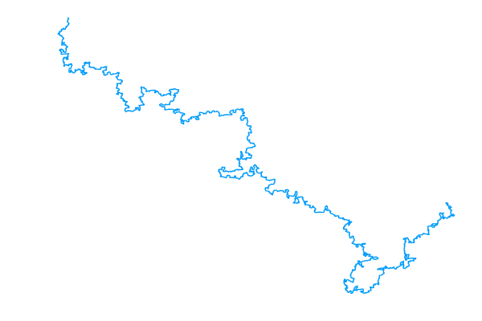
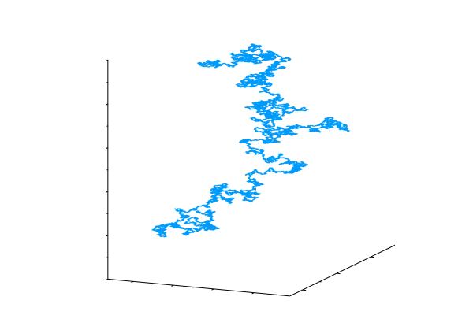
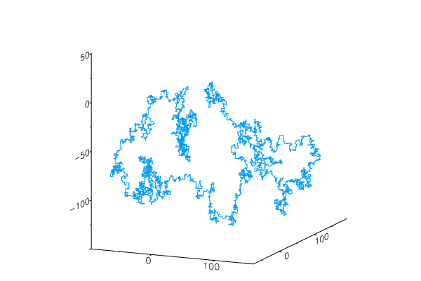
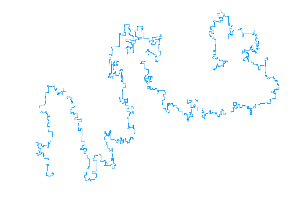

# Polymers

A Julia implementation of the pivot algorithm: a Markov chain Monte carlo (MCMC) sampler for the self-avoiding walk (SAW) model of a linear polymer chain.

### Interactive examples

Click on any of the (static) images below to view interactive examples (generated with [Plotly](https://plot.ly/)).

<table style="width:100%">
	<!-- 2D -->
	<!-- Images -->
	<tr>
		<td><a href="https://plot.ly/~bencwallace/14/" target="_blank"></a></td>
		<td></td>
	</tr>
	<!-- Captions -->
	<tr>
		<td><font size="1">2D SAW with 100 000 steps</font></td>
		<td><font size="1">Pivot algorithm in 2D for a walk with 10 000 steps</font></td>
	</tr>
	<!-- 3D -->
	<!-- Images -->
	<tr>
		<td><a href="https://plot.ly/~bencwallace/16/" target="_blank"></a></td>
		<td></td>
	</tr>
	<!-- Captions -->
	<tr>
		<td><font size="1">3D SAW with 100 000 steps</font></td>
		<td><font size="1">Pivot algorithm in 3D for a walk with 10 000 steps</font></td>
	</tr>
</table>

### Related

My other repository, [*saw*](https://github.com/bencwallace/saw) includes a Python implementation of the pivot algorithm (as well as of the Metropolis-Hastings algorithm for simulating other models of linear polymers) includes a pedagogical explanation of self-avoiding walk and MCMC methods as well as an animated demonstration of the pivot algorithm in a Jupyter [notebook](https://github.com/bencwallace/saw/blob/master/saw-simulation.ipynb).

*Polymers*, on the other hand, places emphasis on speed of computation for the pivot algorithm using [Julia](https://julialang.org/).

## Optimization

This implementation of the pivot algorithm is optimized in the following ways.

* Lattice rotations are represented as `SparseArray` objects. Matrix multiplication by a sparse array can be performed in linear (rather than quadratic) time (in the dimension). The pivot algorithm performs linearly many (in the number of polymer steps) matrix multiplications *per iteration*. An additional advantage of sparse arrays is that they require far less memory.
* Prior to pivoting, the initial (un-pivoted) segment of a walk is converted to a `Set` object, which is a type of hash table, allowing for constant time lookups (as opposed to linear or, at best, logarithmic time for searching an array or list). The conversion itself requires linear time but need only be performed once (per iteration), whereas a linear number of lookups is required. Thus, the speedup per iteration is from quadratic (or at least super-linear) to linear time.

For faster mixing, we also recommend the following:

* Initialize the polymer as a self-avoiding bridge using `bridge` (discussed more below).

The following optimization would also be desirable.

* It should be possible to parallelize the pivot operation since every point on the tail (pivoted) segment of a walk is pivoted independently. This should lead to a roughly linear (in the number of available CPU cores) speedup.

## Usage

### Setup

**Requirements** 

* Developed using Julia 1.1.0
* Interactive polymer plots require [Plotly](https://plot.ly/julia/)

**Installation**

Run the following in the julia REPL:

```julia
julia> using Pkg
julia> Pkg.add("https://github.com/bencwallace/Polymer")
```

### Quick start

Initialize a 3-dimensional polymer as a straight line with 1000 steps:

```julia
using Polymers

poly3d = Polymer(1000, 3);
```

Initialize a 2-dimensional polymer and run the pivot algorithm for 10000 iterations:

```julia
poly = Polymer(1000);
poly = mix(poly, 10000)
```

Plot a polymer:

```julia
poly_plot(poly)
```

Produce an animation of the pivot algorithm run for 100 *successful* steps and save it to "pivot_anim.gif":

```julia
anim(100, line(100), "pivot_anim.gif")
```

### Other initializers

The `stairs` function initializes a polymer in the shape of a staircase.

The `bridge` function initializes a polymeer in the shape of a self-avoiding bridge, which is Markovian and does not take long to generate. This initialization appears to greatly improve mixing, as apparent from the following examples, both of which have 100000 steps and are the result of running the pivot algorithm for 10000 iterations.

<table style="width:100%">
	<!-- Images -->
	<tr>
		<td><a href="https://plot.ly/~bencwallace/12/" target="_blank"></a></td>
		<td><a href="https://plot.ly/~bencwallace/14/" target="_blank"></a></td>
	</tr>
	<!-- Captions -->
	<tr>
		<td><font size="1">2D SAW initialized from a line</font></td>
		<td><font size="1">2D SAW initialized from a bridge</font></td>
	</tr>
</table>
