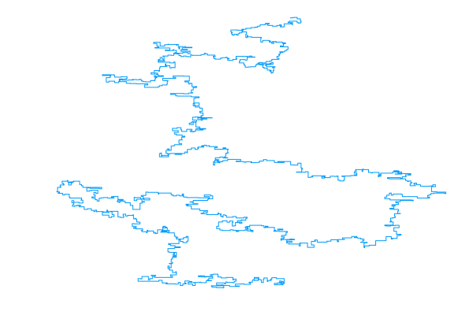
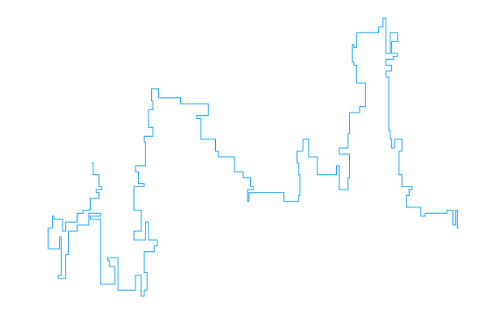

# Polymer

A Julia implementation of the pivot algorithm: a Markov chain Monte carlo (MCMC) sampler for the self-avoiding walk (SAW) model of a linear polymer chain.

## Related

My other repository, [*saw*](https://github.com/bencwallace/saw) includes a Python implementation of the pivot algorithm (as well as of the Metropolis-Hastings algorithm for simulating other models of linear polymers), emphasizes object-oriented design, and includes a pedagogical explanation of self-avoiding walk and MCMC methods in a Jupyter [notebook](https://github.com/bencwallace/saw/blob/master/saw-simulation.ipynb).

*Polymer*, on the other hand, places emphasis on speed of computation for the pivot algorithm using [Julia](https://julialang.org/).

## Optimization

This implementation of the pivot algorithm is optimized in the following ways.

* Lattice rotations are represented as `SparseArray` objects. Matrix multiplication by a sparse array can be performed in linear (rather than quadratic) time in the dimension and must be performed a linear (in the number of steps) number of times *per iteration*. In addition, sparse arrays require much less memory.
* The initial (un-pivoted) segment of a walk is converted to a `Set` object, which is a type of hash table, allowing for constant time lookups (as opposed to linear or, at best, logarithmic time for searching an array or list). Each iteration of the pivot algorithm requires a linear (in the number of steps) number of lookups to check for intersections.

The following optimization would also be desirable.

* It should be possible to parallelize the pivot operation since every point on the tail (pivoted) segment of a walk is pivoted independently. This should lead to a roughly linear (in the number of available CPU cores) speedup.

## Examples

<table style="width:100%">
	<tr>
		<td></td>
		<td></td>
	</tr>
	<tr>
		<td>SAW with 10000 steps</td>
		<td>Pivot algorithm on 1000 steps</td>
	</tr>
</table>
